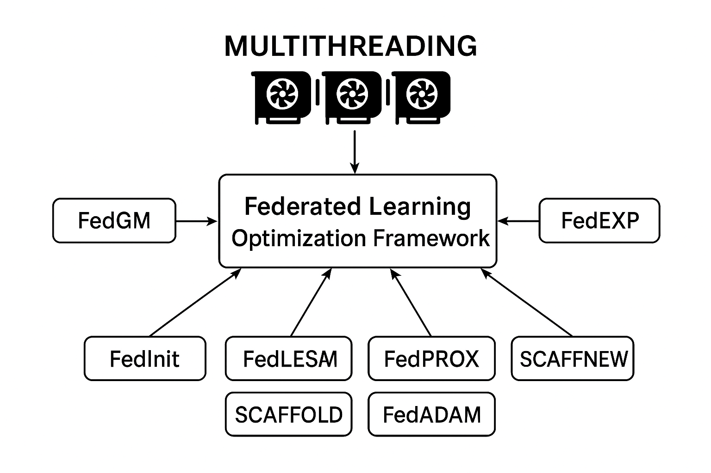

# fedtorch
A federated learning optimization framework. The framework consists of the following methods: FedAVG, FedAVGM, DeltaSGD, DualPROX, FedEXP, FedGM, FedInit, FedLESAM, FedNAR, FedPROX, SCAFFOLD, SCAFFNEW, and FedADAM

    The running examples are located in the experiments directory. Simply configure the appropriate parameters in the libs file and run experiments/CIFAR100/A0d01C100/run.py.



This framework's key feature is its ability to utilize multiple GPUs while Python 3.13 unlocks thread locks, and to virtualize a single GPU into multiple GPUs for use! This means the framework taps into Python's true multithreading potential, significantly boosting training speed.

For example : experiments/\<specific task>/\<A: dirichlet alpha C: Clinets Num>/config.py:

    "cuda_argments":{
        "devices":[
            f"cuda:{i}/{j}" for i in range(4) for j in range(3)
        ]
    },

As long as it conforms to the path rules, the config file will be automatically read.

## Quick start

This repository includes a ready-to-run CIFAR-100 example under `experiments/CIFAR100/A0d01C100`. The CIFAR-100 example provides a simple script to run federated experiments and several configuration knobs to control data heterogeneity, participation and optimizer settings.

Run the example (two common ways):

```bash
# run in foreground
./python3.13t/bin/python3.13t -Xgil=0 ./FederatedX/experiments/CIFAR100/A0d01C100/run.py

# run in background and capture logs
nohup ./python3.13t/bin/python3.13t -Xgil=0 ./FederatedX/experiments/CIFAR100/A0d01C100/run.py > vp.file 2>&1 &
```

> The examples use a custom Python binary in the repository. These custom builds are used to unlock improved threading behavior — adapt the path to the Python executable available in your environment if needed.

## Data partition naming convention

We use a concise folder-naming scheme to indicate how datasets are partitioned among clients.  
Example path: `experiments/CIFAR100/A0d01C100/run.py`

Interpretation of `A0d01C100`:
- `A` denotes the Dirichlet distribution parameter **α**.
- `d` stands for the decimal point (dot) in the numeric representation.
- `C` denotes the number of clients.

So `A0d01C100` means the CIFAR-100 dataset is partitioned among **100 clients** using a Dirichlet distribution with **α = 0.01**.

### Custom partitions
If you want to use a different partitioning scheme, you can:
- rename the folder to match the scheme you choose, or
- create a new folder under `experiments/<DATASET>/` with a descriptive name (and place a `run.py` and `config.py` there).

### How to form other names
Follow the pattern `A{alpha_with_dot_replaced_by_d}C{client_count}`. Examples:
- `A0d10C50` → α = 0.10, 50 clients.
- `A1d00C200` → α = 1.00, 200 clients.

## Parameter tuning — two ways

You can tune experiment parameters in two ways: (1) edit the `CONFIG` dictionary in `experiments/<TASK>/config.py`, or (2) use command-line overrides at runtime.

**1) Edit `config.py` (recommended for reproducibility)**  
Modify the values under `client_trainer_arguments`, `server_arguments`, `cuda_argments`, etc., then save the file and run the experiment. This method is better for long-term tracking and sharing experiments because the configuration lives in a versioned file.

**2) Command-line overrides via `commands` list (used in `run.py`)**  
In this project we also support supplying runtime overrides through the `commands` list constructed in `run.py`. Each entry in `commands` is a tuple of `(ModuleOrTask, arg_fragment)` where `arg_fragment` is a formatted string describing which config section and key to override and the value to use. The experiment runner (`exp.run`) will expand these fragments, concatenate them, and call the target module with the assembled CLI — causing the specified `CONFIG` entries to be temporarily overridden for that run.

Example (from `experiments/CIFAR100/A0d01C100/run.py`):

```python
T = '-fedopt --method adam'
commands = [
    (FedAVG,f'.FedAVG'),
    # (FedADAM,f'.FedADAM {T} .MPX -hyerparams --fedmpx .0.2'),
]
```

## Citation

If you use this code in your research, please cite our paper:

Zhongxiang Lei, Qi Yang, Ping Qiu, Gang Zhang, Yuanchi Ma, and Jinyan Liu, "Why Federated Optimization Fails to Achieve Perfect Fitting? A Theoretical Perspective on Client-Side Optima", arXiv:2511.00469, 2025. Available at: http://arxiv.org/abs/2511.00469.

BibTeX:

```bibtex
@misc{lei2025federatedoptimizationfailsachieve,
      title={Why Federated Optimization Fails to Achieve Perfect Fitting? A Theoretical Perspective on Client-Side Optima}, 
      author={Zhongxiang Lei and Qi Yang and Ping Qiu and Gang Zhang and Yuanchi Ma and Jinyan Liu},
      year={2025},
      eprint={2511.00469},
      archivePrefix={arXiv},
      primaryClass={cs.LG},
      url={https://arxiv.org/abs/2511.00469}, 
}
